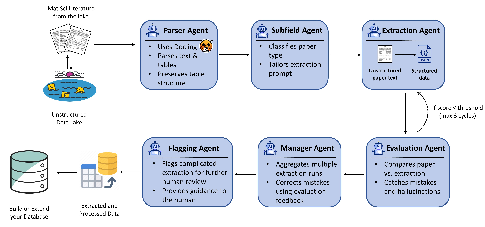

[](https://pyscaffold.org/)

# **KnowMat**: Agentic Pipeline for Materials Science Data Extraction



*Figure: Schematic of the KnowMat agentic pipeline for extracting structured materials data from scientific literature.*

---

## Overview

**KnowMat** is an advanced, AI-powered Agentic pipeline that automatically extracts structured, machine-readable materials science data from unstructured scientific literature (PDFs). Built on **LangGraph** and powered by **OpenAI GPT models**, KnowMat orchestrates multiple intelligent agents that collaborate to parse papers, extract compositions, processing conditions, characterization details, and material properties with high accuracy.

### Key Capabilities

- **Research-scale extraction**: Batch process entire folders of PDFs
- **High accuracy**: Multi-agent architecture with iterative refinement (up to 3 extraction/evaluation cycles)
- **Advanced PDF parsing**: Uses **Docling** for superior table extraction and structure preservation
- **Two-stage validation**: Rule-based aggregation + LLM-based hallucination correction
- **Property standardization**: Automatic mapping of property names to standard forms using GPT-5-mini
- **Quality assurance**: Confidence scoring, flagging system, and human review guides
- **ML-ready output**: Structured JSON format designed for database ingestion and machine learning

---

## Key Features

### 🤖 **Multi-Agent Architecture**
- **Parser Agent**: Docling-based PDF parsing with advanced table extraction
- **Subfield Detection Agent**: Identifies paper type (experimental/computational/ML) and tailors extraction prompts
- **Extraction Agent**: GPT-5 powered structured data extraction using TrustCall
- **Evaluation Agent**: Iterative quality assessment with confidence scoring (up to 3 cycles)
- **Two-Stage Manager**:
  - **Stage 1 (Aggregation)**: Fast, rule-based merging of extraction runs
  - **Stage 2 (Validation)**: LLM-based hallucination detection and correction
- **Flagging Agent**: Final quality assessment and review recommendations

### 📊 **Comprehensive Data Extraction**
- Material compositions (elements, stoichiometry, normalized formulas)
- Processing conditions (temperature, pressure, atmosphere, time)
- Characterization methods and results
- Material properties with ML-ready format:
  - Exact values, ranges, inequalities (>, <, ≥, ≤)
  - Numeric extraction with proper handling of qualitative properties
  - Value types: exact, lower_bound, upper_bound, range, qualitative, missing

### 🔬 **Property Standardization**
- Automatic mapping of property names to standard forms using GPT-5-mini
- Handles symbols, abbreviations, and domain-specific terminology

### 🛡️ **Quality Assurance**
- Confidence scoring for each extraction run
- Hallucination detection using evaluation feedback
- Safety checks for placeholder responses and lazy fallbacks
- Flagging system for human review
- Detailed rationales and review guides

### ⚡ **Production Features**
- Batch processing of entire PDF folders
- Per-paper output directories with structured organization
- Comprehensive JSON output with extraction metadata
- Human-readable analysis reports
- LangSmith tracing integration for debugging
- Per-agent model configuration (mix GPT-5 and GPT-5-mini for cost optimization)

---

## Architecture

### Pipeline Flow

```
PDF Input
   ↓
┌─────────────────────────────────────────────┐
│ 1. Parser Agent (Docling)                  │
│    - Extract text, tables, structure       │
│    - Remove references/citations            │
└─────────────────────────────────────────────┘
   ↓
┌─────────────────────────────────────────────┐
│ 2. Subfield Detection Agent (GPT-5-mini)   │
│    - Classify paper type                    │
│    - Generate tailored extraction prompt    │
└─────────────────────────────────────────────┘
   ↓
┌─────────────────────────────────────────────┐
│ 3-5. Extraction/Evaluation Loop (≤3 cycles) │
│    Extraction Agent (GPT-5 + TrustCall):    │
│      - Extract structured data              │
│    Evaluation Agent (GPT-5):                │
│      - Assess accuracy vs. source text      │
│      - Assign confidence score              │
│      - Suggest prompt refinements           │
│    (Repeat extraction if confidence < threshold)│
│    (Maximum 3 cycles)                       │
└─────────────────────────────────────────────┘
   ↓
┌─────────────────────────────────────────────┐
│ 6. Two-Stage Manager                        │
│    Stage 1 - Aggregation (Rule-Based):      │
│      - Merge 3 extraction runs              │
│      - Select best compositions             │
│      - Deduplicate properties               │
│    Stage 2 - Validation (GPT-5):            │
│      - Detect hallucinations                │
│      - Correct using evaluation feedback    │
│      - Validate ML-ready format             │
│      - Generate review guide                │
└─────────────────────────────────────────────┘
   ↓
┌─────────────────────────────────────────────┐
│ 7. Property Standardization (GPT-5-mini)    │
│    - Map properties to standard forms       │
│    - Match against known property database  │
└─────────────────────────────────────────────┘
   ↓
┌─────────────────────────────────────────────┐
│ 8. Flagging Agent (GPT-5-mini)              │
│    - Final quality assessment               │
│    - Human review recommendations           │
└─────────────────────────────────────────────┘
   ↓
Structured JSON Output
```

### Output Structure

Each processed paper creates a dedicated folder:

```
data/processed/
└── <PaperName>/
    ├── <PaperName>_extraction.json          # Final structured data
    ├── <PaperName>_analysis_report.txt      # Human-readable summary
    ├── <PaperName>_runs.json                # All extraction runs with metadata
    └── docling_parse/
        ├── <PaperName>_final_output.md      # Parsed markdown text
        ├── table_html/
        │   └── <PaperName>-table-N.html     # Tables as HTML (visualizable in browser)
        └── table_images/
            ├── <PaperName>-table-N.png      # Table images
            └── <PaperName>-table-N.png.b64.txt
```

---

## Installation

### Prerequisites

1. **Python 3.11** with Conda
2. **OpenAI API Key** (for GPT-5/GPT-5-mini models)
3. **LangChain API Key** (optional, for LangSmith tracing)

### Setup Steps

1. **Clone the Repository**:
   ```bash
   git clone https://github.com/hasan-sayeed/KnowMat2.git
   cd KnowMat2
   ```

2. **Create Conda Environment**:
   ```bash
   conda env create -f environment.yml
   conda activate KnowMat
   ```

3. **Configure API Keys**:
   
   Rename the provided example file `.env_example` to `.env` and add your API keys.
   
   Alternatively, set as environment variables:
   ```bash
   # Windows PowerShell
   $env:OPENAI_API_KEY="your_key"
   
   # Linux/Mac
   export OPENAI_API_KEY="your_key"
   ```
   
   If not set, KnowMat will prompt you interactively on first run.

4. **Verify Installation**:
   ```bash
   python -m knowmat --help
   ```

---

## Usage

### Basic Command Line Usage

Process a single folder of PDFs:

```bash
python -m knowmat --pdf-folder path/to/pdfs --output-dir output/directory
```

### Advanced Options

```bash
python -m knowmat \
    --pdf-folder path/to/pdfs \
    --output-dir output/directory \
    --max-runs 3 \
    --extraction-model gpt-5 \
    --evaluation-model gpt-5 \
    --manager-model gpt-5 \
    --subfield-model gpt-5-mini \
    --flagging-model gpt-5-mini
```

### Command Line Arguments

| Argument | Description | Default |
|----------|-------------|---------|
| `--pdf-folder` | Path to folder containing PDFs (required) | - |
| `--output-dir` | Directory for outputs | `./data/processed` |
| `--max-runs` | Maximum extraction/evaluation cycles | `3` |
| `--subfield-model` | Model for subfield detection | `gpt-5-mini` |
| `--extraction-model` | Model for data extraction | `gpt-5` |
| `--evaluation-model` | Model for quality evaluation | `gpt-5` |
| `--manager-model` | Model for validation (Stage 2) | `gpt-5` |
| `--flagging-model` | Model for final quality assessment | `gpt-5-mini` |

### Python API

```python
from knowmat.orchestrator import run

result = run(
    pdf_path="path/to/paper.pdf",
    output_dir="data/processed",
    max_runs=3,
    # Per-agent overrides:
    extraction_model="gpt-5",
    evaluation_model="gpt-5",
    manager_model="gpt-5",
    subfield_model="gpt-5-mini",
    flagging_model="gpt-5-mini",
)

print(f"Extracted {len(result['final_data']['compositions'])} compositions")
print(f"Confidence: {result.get('confidence_score', 0):.2f}")
print(f"Flagged: {result['flag']}")
```

---

### Output Examples

**JSON Output Structure**

```json
{
  "compositions": [
    {
      "composition": "Zr64.13Cu15.75Ni10.12Al10",
      "composition_normalized": "Zr64Cu16Ni10Al10",
      "processing_conditions": {
        "method": "melt spinning",
        "temperature": "1400 K",
        "cooling_rate": "10^6 K/s",
        "atmosphere": "argon"
      },
      "characterization": {
        "XRD": "amorphous structure confirmed",
        "DSC": "glass transition at 625 K; crystallization at 705 K"
      },
      "properties_of_composition": [
        {
          "property_name": "glass transition temperature",
          "property_symbol": "Tg",
          "value": "625",
          "value_numeric": 625.0,
          "value_type": "exact",
          "units": "K"
        },
        {
          "property_name": "fracture strength",
          "property_symbol": "σ_max",
          "value": ">1800",
          "value_numeric": 1800.0,
          "value_type": "lower_bound",
          "units": "MPa"
        }
      ]
    }
  ]
}
```

---

## Project Organization

```
├── AUTHORS.md              <- List of developers and maintainers
├── CHANGELOG.md            <- Changelog to keep track of new features and fixes
├── CONTRIBUTING.md         <- Guidelines for contributing to this project
├── LICENSE.txt             <- MIT License
├── README.md               <- This file
├── environment.yml         <- Conda environment specification
├── pyproject.toml          <- Build configuration
├── setup.cfg               <- Package metadata and dependencies
├── setup.py                <- Setup script (deprecated, use pip install -e .)
│
├── configs/                <- Configuration files
│   └── properties.json     <- Property database for standardization
│
├── data/
│   ├── raw/                <- Original, immutable PDF files
│   └── processed/          <- Extracted structured data
│       └── <PaperName>/    <- Per-paper output folders
│
├── src/
│   └── knowmat/            <- Main package
│       ├── __init__.py
│       ├── __main__.py     <- CLI entry point
│       ├── orchestrator.py <- Pipeline orchestration (LangGraph)
│       ├── app_config.py   <- Settings and configuration
│       ├── config.py       <- Environment setup
│       ├── states.py       <- LangGraph state definitions
│       ├── extractors.py   <- Pydantic schemas for TrustCall
│       ├── prompt_generator.py <- Dynamic prompt generation
│       ├── post_processing.py  <- Property standardization
│       └── nodes/          <- Agent implementations
│           ├── docling_parse_pdf.py  <- Parser agent
│           ├── subfield_detection.py <- Subfield agent
│           ├── extraction.py         <- Extraction agent
│           ├── evaluation.py         <- Evaluation agent
│           ├── aggregator.py         <- Manager Stage 1
│           ├── validator.py          <- Manager Stage 2
│           └── flagging.py           <- Flagging agent
│
├── tests/                  <- Unit tests (pytest)
├── notebooks/              <- Jupyter notebooks for analysis
└── docs/                   <- Sphinx documentation
```

---

## Advanced Features

### Two-Stage Manager Architecture

KnowMat's unique two-stage manager architecture separates data merging from validation:

**Stage 1 - Aggregation (Rule-Based)**:
  - Fast, deterministic merging of extraction runs
  - No LLM calls (zero cost, zero latency)
  - Selects highest-confidence run as base
  - Merges additional compositions from other runs
  - Deduplicates properties using (name, symbol) signatures

**Stage 2 - Validation (LLM-Based)**:
- Focused hallucination detection using evaluation feedback
- Correction of hallucinated properties
- ML-ready format validation
- Safety checks for placeholder responses
- Retry mechanism with stronger prompts
- Human review guide generation

### Property Standardization

The PostProcessor uses GPT-5-mini to intelligently map extracted property names to standard forms:

```python
from knowmat.post_processing import PostProcessor

processor = PostProcessor(
    properties_file="configs/properties.json",
    gpt_model="gpt-5-mini"
)

standardized = processor.standardize_properties(extracted_data)
```

**Example Mappings**:
- "Dimensionless figure of merit ZT" → "thermoelectric figure of merit"
- "glass transition temp" → "glass transition temperature"
- "ultimate tensile strength" → "tensile strength"
- "Young's modulus" → "elastic modulus"

### Batch Processing

Process hundreds of papers efficiently:

```bash
# Process entire folder
python -m knowmat --pdf-folder data/raw/papers --output-dir data/processed

# Console shows progress for each paper
Processing PDF 1/150: paper001.pdf
Processing PDF 2/150: paper002.pdf
...

# Final summary
Total PDFs: 150
Successful: 147
Failed: 3
Flagged for review: 23
Total compositions: 2,341
```

---

## Model Selection and Cost Optimization

KnowMat supports per-agent model configuration, allowing you to balance cost and accuracy:

### Recommended Configuration (Production)

```bash
--subfield-model gpt-5-mini      # Simple classification
--extraction-model gpt-5         # Complex structured extraction
--evaluation-model gpt-5         # Accuracy assessment
--manager-model gpt-5            # Hallucination correction
--flagging-model gpt-5-mini      # Final quality check
```

**Cost per paper**: ~$0.75-1.30 (varies by paper length and complexity)

### Budget Configuration

```bash
--subfield-model gpt-5-mini
--extraction-model gpt-5-mini
--evaluation-model gpt-5-mini
--manager-model gpt-5-mini
--flagging-model gpt-5-mini
```

**Cost per paper**: ~$0.15-0.30 (reduced accuracy)

---

## Troubleshooting

### Common Issues

**1. API Key Errors**
```
Error: OPENAI_API_KEY not set
```
**Solution**: Create `.env` file or set environment variable:
```bash
export OPENAI_API_KEY="your_key"
```

**2. Docling Parsing Failures**
```
Error: Docling parsing failed
```
**Solution**: Ensure PDF is not corrupted or password-protected. Try re-downloading the PDF.

**3. Low Confidence Scores**
```
Warning: All runs flagged for review
```
**Solution**: 
- Check if PDF contains actual data tables (not just images)
- Verify the paper is a materials science paper
- Use higher-quality models (GPT-5 instead of GPT-5-mini)

**4. Property Standardization Failures**
```
Warning: Property standardization failed
```
**Solution**: Ensure `src/knowmat/properties.json` exists and is valid JSON.

### Debug Mode

Enable verbose LangSmith tracing:

```bash
export LANGCHAIN_TRACING_V2=true
export LANGCHAIN_PROJECT=KnowMat2
```

Then check traces at: https://smith.langchain.com/


---

## Roadmap

- [ ] **Web Interface**: Reimplement Flask UI for non-technical users
- [ ] **Database Integration**: Direct export to PostgreSQL/MongoDB
- [ ] **Enhanced Table Parsing**: Improved handling of multi-page and rotated tables
- [ ] **Active Learning**: User feedback loop for property database expansion
- [ ] **Multi-Language Support**: Extraction from non-English papers
- [ ] **Domain Expansion**: Support for chemistry, biology, and physics papers

---

## Citation

If you use KnowMat in your research, please cite:

```bibtex
@software{knowmat2024,
  title = {KnowMat: Agentic Pipeline for Materials Science Data Extraction},
  author = {Sayeed, Hasan},
  year = {2024},
  url = {https://github.com/hasan-sayeed/KnowMat2}
}
```

---

## Contributing

We welcome contributions! Please see [CONTRIBUTING.md](CONTRIBUTING.md) for guidelines.

**How to contribute**:
1. Fork the repository
2. Create a feature branch (`git checkout -b feature/amazing-feature`)
3. Commit your changes (`git commit -m 'Add amazing feature'`)
4. Push to the branch (`git push origin feature/amazing-feature`)
5. Open a Pull Request

---

## License

This project is licensed under the MIT License - see [LICENSE.txt](LICENSE.txt) for details.

---

## Acknowledgments

- Built with [PyScaffold](https://pyscaffold.org/)
- Powered by [LangGraph](https://github.com/langchain-ai/langgraph) and [LangChain](https://github.com/langchain-ai/langchain)
- PDF parsing by [Docling](https://github.com/DS4SD/docling)
- Inspired by the MI-Agent architecture

---

## Support

For questions, bug reports, or feature requests:
- **GitHub Issues**: https://github.com/hasan-sayeed/KnowMat2/issues
- **Email**: hasan.sayeed@utah.edu


<!-- pyscaffold-notes -->

## Note

This project has been set up using [PyScaffold] 4.6 and the [dsproject extension] 0.7.2.

[conda]: https://docs.conda.io/
[pre-commit]: https://pre-commit.com/
[Jupyter]: https://jupyter.org/
[nbstripout]: https://github.com/kynan/nbstripout
[Google style]: http://google.github.io/styleguide/pyguide.html#38-comments-and-docstrings
[PyScaffold]: https://pyscaffold.org/
[dsproject extension]: https://github.com/pyscaffold/pyscaffoldext-dsproject
